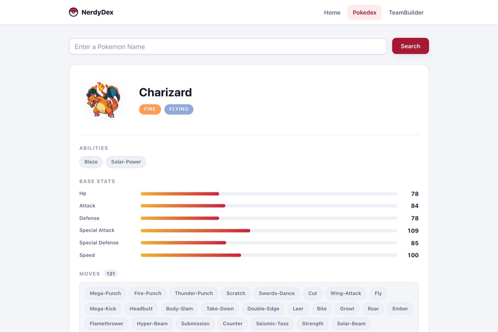
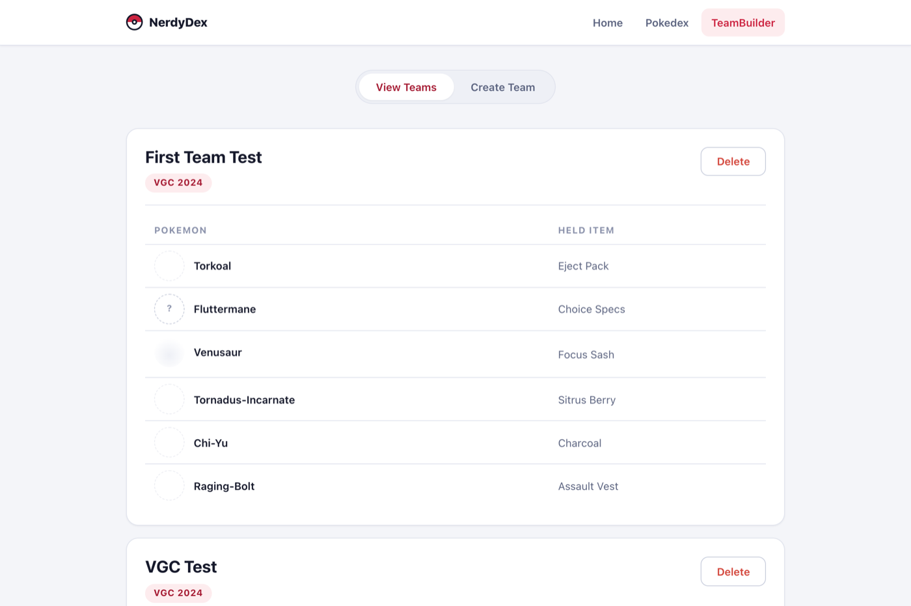
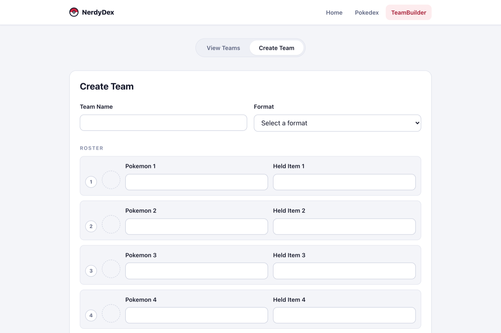

# NérdyDex

A Pokédex and team builder — the wannabe version of
[Pokémon Showdown](https://www.pokemonshowdown.com).

▶︎ **[Open it](https://nerdy-dex.vercel.app/)**



## What it does

**Pokédex** — search any Pokémon by name and get its sprite, types, abilities,
base stats as bars, and its full move pool, live from
[PokéAPI](https://pokeapi.co).

**Team builder** — build a team of six with their held items, save it, and
come back to it later. Teams live in Airtable, so they survive a refresh.

**Home** — a different Pokémon every time you load the page, with its Pokédex
entry.





## Running it

The app is in `pokedex-project/`.

```bash
cd pokedex-project
npm install
cp .env.example .env      # then fill it in
npm start
```

| Variable                     | What it is                        |
| ---------------------------- | --------------------------------- |
| `REACT_APP_AIRTABLE_API_KEY` | Airtable personal access token     |
| `REACT_APP_AIRTABLE_BASE_ID` | the base holding the teams table   |

> **`REACT_APP_*` variables are baked into the bundle at build time**, which
> means the Airtable token ships to the browser and anyone can read it. Fine
> for a scoped, disposable token on a personal project; don't point it at a
> base you care about. Moving the Airtable calls behind a small server would
> be the real fix.

PokéAPI needs no key.

## How it's put together

```
pokedex-project/src/
├── pages/
│   ├── Home.jsx          random Pokémon and its dex entry
│   ├── Pokedex.jsx       search, then sprite / types / abilities / stats / moves
│   └── TeamBuilder.jsx   view and create teams
├── components/
│   ├── CreateTeamForm.jsx  fields mirroring the Airtable columns
│   ├── ViewTeams.jsx       the saved teams, with delete
│   ├── PokemonSprite.jsx   sprite lookup by name
│   └── Navbar.jsx
└── utilities/
    ├── airtable.js       reads and writes the teams table
    └── sprites.js        PokéAPI sprite lookups
```

Search state lives in `Pokedex.jsx` and drives the PokéAPI request; the form
in `CreateTeamForm.jsx` mirrors the Airtable columns field for field, so a
team round-trips without any mapping in between.

## Still to do

- fuzzy search, so a near-miss spelling still finds the Pokémon
- sprites in **View Teams**, so a saved team is something you can look at
  rather than read
- validate team entries against PokéAPI on save, so a typo can't be stored
- richer team view — [Marriland's team builder](https://marriland.com/tools/team-builder/)
  is the bar
